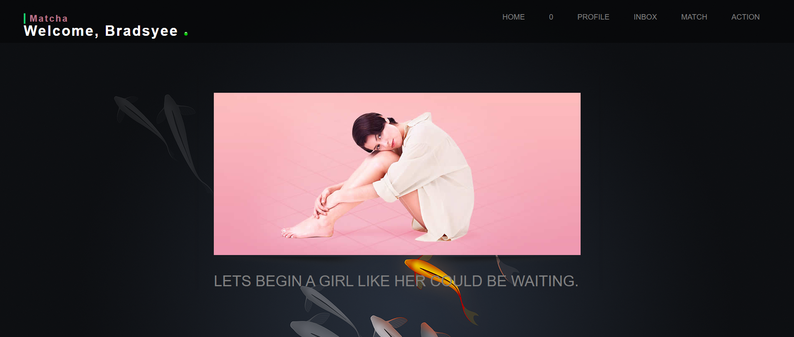
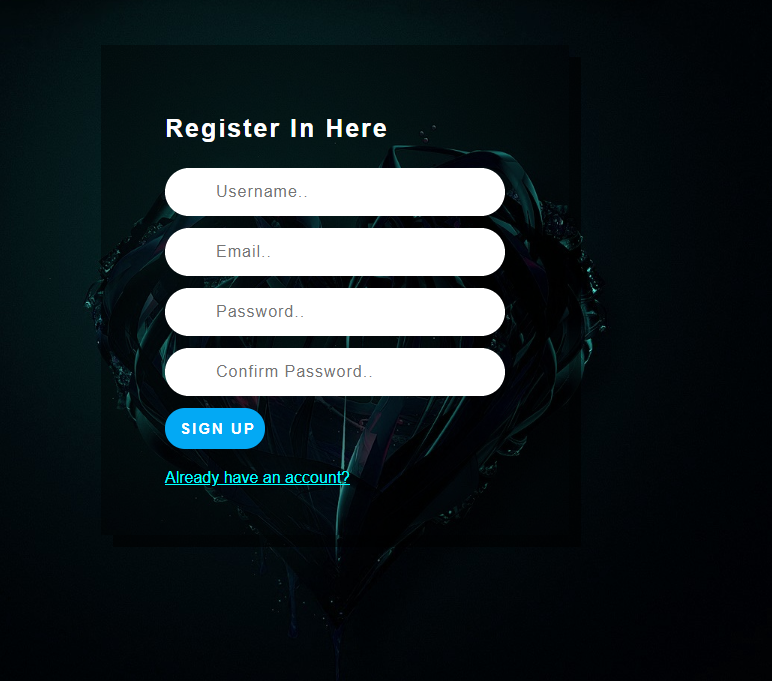
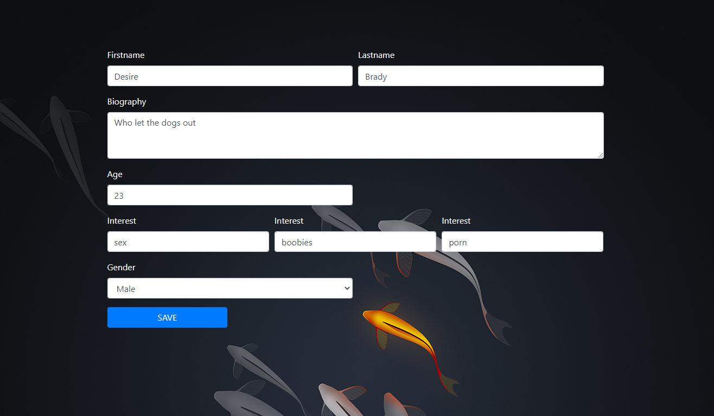
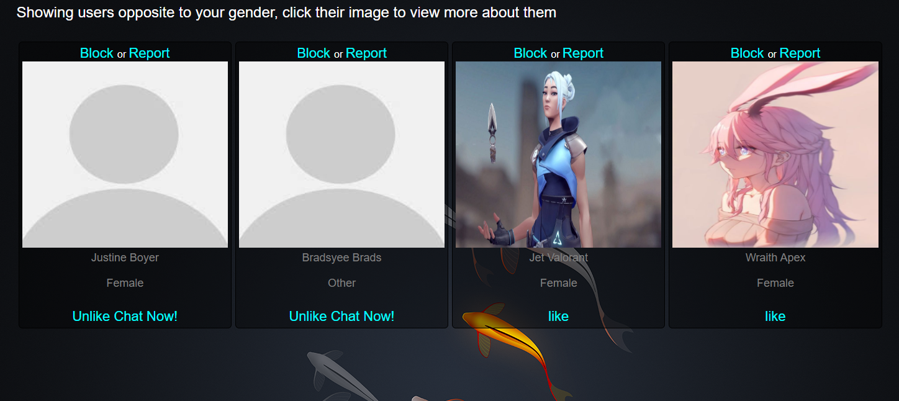

# Matcha-42 School projet - Web
This is a dating website like tinder where users macth and chat by their interests and location

Tools Needed
Install vs code for editing code 
Visual Studio Code is a free and built on open source. Integrated Git, debugging and extensions. https://code.visualstudio.com/download

Our apache server will be xampp install this to be able to see the website
XAMPP is a completely free, easy to install Apache distribution containing MariaDB, PHP, and Perl. The XAMPP open source package has been set up to be incredibly easy to install and to use. https://www.apachefriends.org/index.html

Start the apache and mysql servers 
clone the web application  from this repo and copy into the xampp htdocs folder
put the url http://localhost/camagru/ into your browser and you good to GO!

I used MySql for database, Bootstrap for css

we had to implement a tinder like app 

Edit your profile

The app matches users by gender, loacation and age

